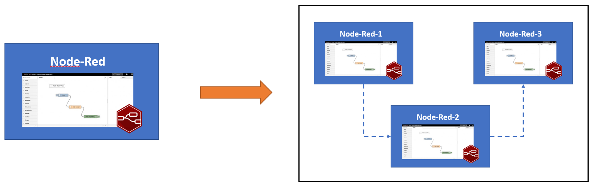
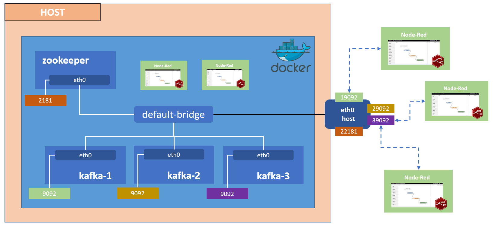
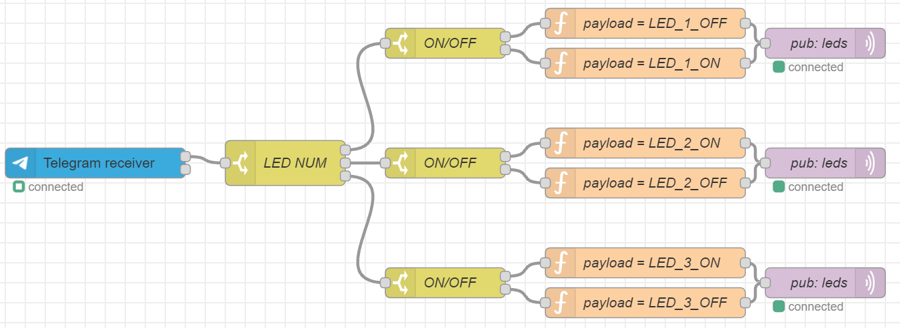
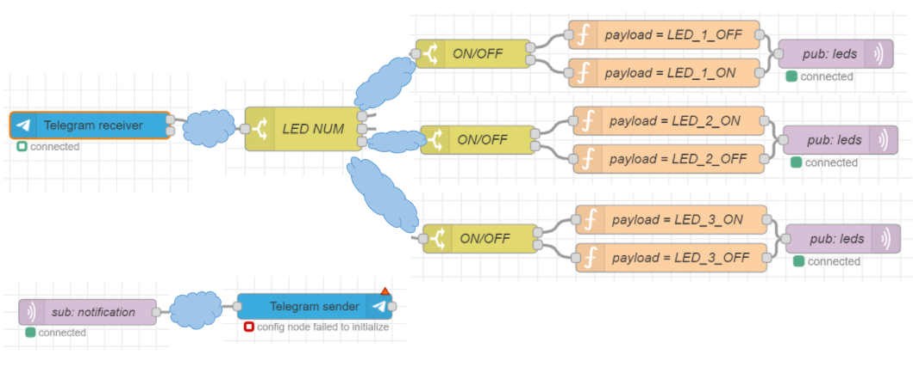

# Distributed Node-RED flows

---
## Assignment

> You are to implement an architecture that allows Node-red flows to span multiple devices.
Normally, a Node-red flow executes locally to the machine where it is installed.
Instead, consider multiple Node-red installations that:\
• register to a central repository that maintains information on all running installations\
• can exchange messages among them by logically connecting the output of a node in
one installation to the input of another node in a different installation\
Addressing of Node-RED installations must be content-based, that is, the target Node-red
installations that receive the messages cannot be determined based on their IP address or
some other form of machine-level identifier.
---
## Structure and more info
A report with all the specs and design choices made in the project
can be found at `./report/report.pdf`.

---
## Demo
The demo consists in dividing a previously defined flow into multiple
(and probably excessive) sub-flows. 
The initial flow is defined as follows:

It is composed of a Telegram bot that listens for new messages
(using the pre-built node of Telegram) and act upon newly received
messages by turning ON/OFF the appropriate led of ESP-32 modules.\
This is achieved by publishing messages into an MQTT topic where
the ESP-32 are registered. 

As you can see in the picture above the initial flow is divided and distributed between
7 different Node-RED installations that cooperates together. \
The light-blue clouds represents the middleware infrastructure, namely Kafka,
responsible for forwarding the messages to the proper nodes.

### How to run the demo
1. Change the value `token` inside of all the  .json files in the `creds`
folder matching the token of your personal Telegram bots ([more info](https://core.telegram.org/bots)).
   1. Please note that you need to create two different bots one for sending and one for receiving
   the outputs (this is a limitation imposed by the Telegram API on the
   concurrent accesses)
   2. The tokens are all equal except for the ones of `flows_6_cred.json`, here put the token
   of the bot responsible for the replies. 
2. Run the demo by typing `docker-compose -f ./docker-compose-demo-yml up -d`
3. Send `#num off/on` in your telegram bot to trigger the change in the ESP-32 setup (`#num` must be a number ranging from 1 to 3)
   1. Example: `3 on`
4. To access the different components of the project:
   1. Node-RED nodes: `localhost:[1881 -> 1887]`
   2. Kafka-UI: `localhost:8080` useful to investigate the behaviour of Kafka 

Kafka brokers:
kafka-1:9092 (ext. 19092)
kafka-2:9092 (ext. 29092)
kafka-1:9092 (ext. 39092)
Zookeeper server:
zookeeper-1:2181 (ext. 22181)
Kafka-ui (available at localhost:8080)
Node-Red instances:
node-red-1:1880 (ext. 1881)
node-red-2:1880 (ext. 1882)
node-red-3:1880 (ext. 1883)
Node.JS is required to run the kafkaJS demos.

In the folder custom-nodes the new Node-Red nodes will be developed.

---
## Folder structure
- `creds` 
  - Credentials needed by the node-red installations to access the Telegram bot
  and the MQTT broker
- `custom-nodes` 
  - Folder containing the custom node-red nodes
- `report` 
  - Folder containing report files
- `docker-compose.yml` 
- `docker-compose-demo.yml`
- `Dockerfile` 
  - Builds a custom node-red image with the plugins pre-installed
---
